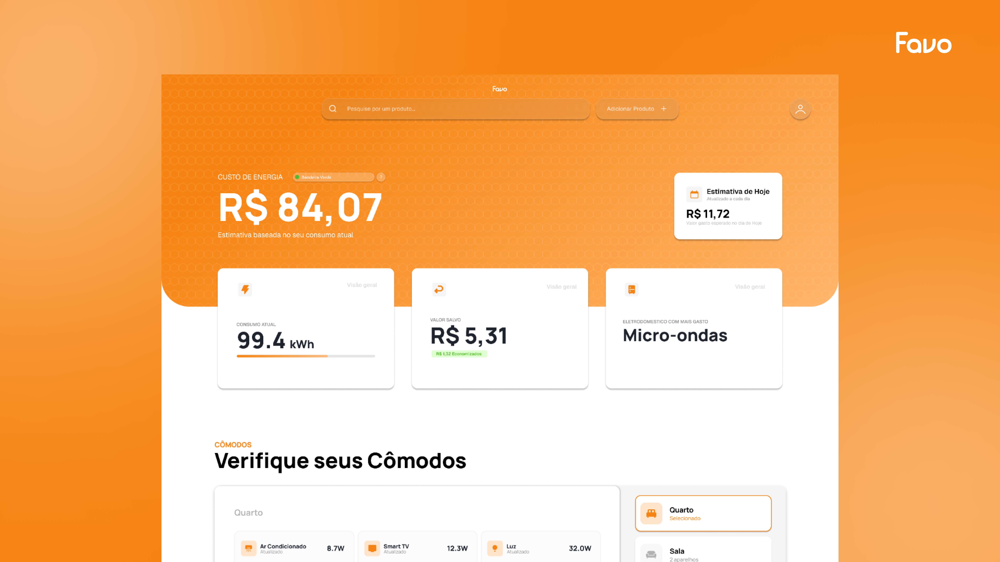

  
<h1><b>Sistema Web de Organização de Gasto de Energia - Favo</b></h1>

O Favo é um sistema web desenvolvido para a gestão do consumo de energia em residências, um segmento que representa uma parcela significativa dos gastos energéticos das famílias. O sistema apresenta todos os dados relevantes sobre o consumo de energia de forma simples, clara e acessível, permitindo que qualquer usuário compreenda e acompanhe seu uso de maneira eficiente. 
A ideia para o projeto surgiu a partir da observação da necessidade real das famílias por ferramentas que auxiliem no planejamento e na gestão dos seus gastos domésticos.

O projeto foi pensado porque no Brasil a população não tem uma gestão tão eficiente dos gastos domésticos, principalmente em relação ao de energia elétrica, que representa uma fração considerável, que precisa ser mais bem planejada e observada pela população em geral.

<h1>Visualização</h1>
<h5>(Não Disponivel)</h5>
<h5> 1. Clone o repositório: git clone https://github.com/ZzoeNdev/Favo </h5>
<h5> 2. Abra o arquivo index.html no seu navegador. </h5>

<h1 align="center">Overview:</h1>

<h4 align="center"> Desenvolvido por Equipe Favo</h4>
